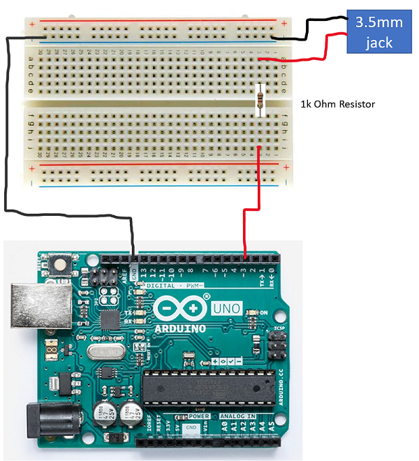

# Springboard
Arduino controller that will read data from the Raspberry PI running our calibration and data-merge software and use it to drive inputs into the Xbox Adaptive Controller (XAC).

## Setup
1) Download and install the [Arduino IDE](https://www.arduino.cc/en/main/software)
2) Optionally, install the Arduino extension for Visual Studio Code if you'd like to work entirely within vs code.

## Board wiring
The springboard software simply turns on/off a set of the digital pins on the Arduino based on the input coming from the connected Raspberry PI board.

The following diagram shows how to wire up 1 pin to a corresponding 3.5mm jack. Scale it up as needed.

## Building & Deploying Software

### Arduino IDE
1) Load up the springboard.ino sketch file in the Arduino IDE
2) Select the board you're deploying to in the "Tools->Board..." menu. (*If needed, download a new package for your board using the board manager*)
3) Upload the board by using CTRL+U, or using the "Sketch->Upload" menu. 

### VS Code Arduino Extension
1) Open the springboard.ino sketch file in vs code.
2) Press F1 to bring up the Arduino commands and select the board you're deploying to by choosing the "Arduino: Change board type" command. (*If needed, download a new package for you board by using the "Arduino: Board manager" command.*)
3) To upload the sketch file, press F1 to bring up the command palette and choose "Arduino: Upload"